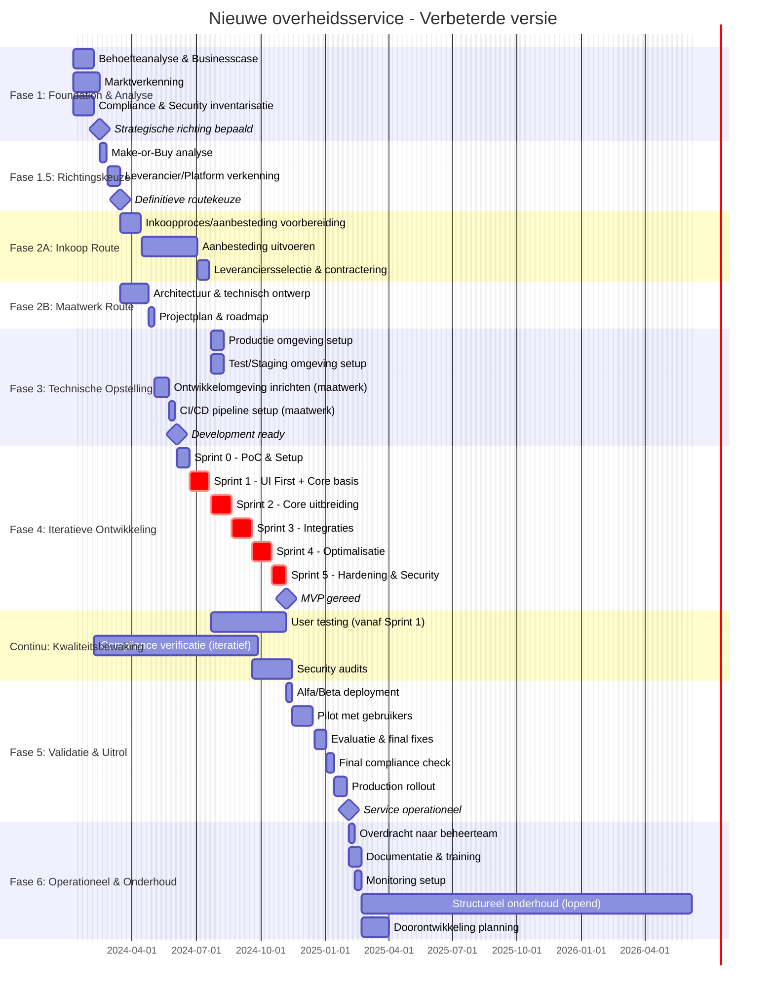

# Nieuwe Overheidsservice

Dit gebaande pad biedt een stapsgewijze aanpak voor het ontwikkelen en lanceren van een nieuwe digitale overheidsservice, van concept tot productie.

<!-- | Stap | Rollen | Tijd | Hoofdresultaat |
|------|--------|------|----------------|
| 1. Behoefteanalyse & Businesscase | Beleid en Advies, Bestuurder, Projectleider | 2-4 weken | Goedgekeurde businesscase & Helderheid over gebruikersbehoefte |
| 2. Technische opstelling & beveiligingskaders | Ontwikkelaar, Jurist | 1-3 weken | Technische opstelling |
| 2b. Inkoop & Leveranciersselectie | Inkoper, Projectleider | 1-2 weken | Contracten en leveranciers |
| 3. Ontwikkelomgeving Opzetten | Ontwikkelaar, Projectleider | 1 week | Werkende CI/CD-pipeline |
| 4. Ontwikkeling & Testen | Ontwikkelaar, Projectleider | 6-12 weken | Geteste minimaal werkende versie |
| 5. Compliance & Beveiligingsaudit | Jurist, Beleid en Advies | 2-3 weken | Beveiligingscertificering |
| 6. Uitrol & Productiegang | Ontwikkelaar, Bestuurder | 1 week | Operationele dienst |

--- -->

## Projectstappen

<html>
<body>
    

        

            
            

                

                    
stap 1

                    <h4 class="step-title">Behoefteanalyse & Businesscase</h4>
                    
⏱️ 2-4 weken

                    

                        Beleid en Advies
                        Bestuurder
                        Projectleider
                    

                    

                        
Hoofdresultaat:

                        
Goedgekeurde businesscase

                    

                

                

                    
stap 2

                    <h4 class="step-title">Technische opstelling & beveiligingskaders</h4>
                    
⏱️ 1-3 weken

                    

                        Ontwikkelaar
                        Jurist
                    

                    

                        
Hoofdresultaat:

                        
Technische opstellingsdocument (met verwijzingen naar NORA-bouwstenen, GEMMA-modellen, Common Ground principes).

                    

                

                

                    
stap 2b

                    <h4 class="step-title">Inkoop & Leveranciersselectie</h4>
                    
⏱️ 1-2 weken

                    

                        Inkoper
                        Projectleider
                    

                    

                        
Hoofdresultaat:

                        
Contracten en leveranciers

                    

                    
💡 Kan parallel lopen met stap 2

                

                

                    
stap 3

                    <h4 class="step-title">Ontwikkelomgeving Opzetten</h4>
                    
⏱️ 1 week

                    

                        Ontwikkelaar
                        Projectleider
                    

                    

                        
Hoofdresultaat:

                        
Werkende CI/CD-pipeline

                    

                

                

                    
stap 4

                    <h4 class="step-title">Ontwikkeling & Testen</h4>
                    
⏱️ 6-12 weken

                    

                        Ontwikkelaar
                        Projectleider
                    

                    

                        
Hoofdresultaat:

                        
Geteste minimaal werkende versie

                    

                

                

                    
stap 5

                    <h4 class="step-title">Compliance & Beveiligingsaudit</h4>
                    
⏱️ 2-3 weken

                    

                        Jurist
                        Beleid en Advies
                    

                    

                        
Hoofdresultaat:

                        
Beveiligingscertificering

                    

                

                

                    
stap 6

                    <h4 class="step-title">Uitrol & Productiegang</h4>
                    
⏱️ 1 week

                    

                        Ontwikkelaar
                        Bestuurder
                    

                    

                        
Hoofdresultaat:

                        
Operationele dienst

                    

                

            

        

        

            <h3>Projectoverzicht</h3>
            

                

                    <strong>Totale projectduur</strong>
                    13-25 weken (afhankelijk van complexiteit)
                

                

                    <strong>Kritieke fase</strong>
                    Ontwikkeling & Testen (6-12 weken - 50% van project)
                

                

                    <strong>Belangrijkste risico</strong>
                    Compliance audit kan onverwachte vertragingen veroorzaken
                

                

                    <strong>Efficiëntie tip</strong>
                    Stap 2 en 2b kunnen tegelijkertijd uitgevoerd worden

```mermaid
gantt
    dateFormat  YYYY-MM-DD
    title       Nieuwe overheidsservice 
    excludes    weekends
    
    section Fase 1: Foundation
    Behoefteanalyse & Businesscase        :step1, 2024-01-08, 4w
    Compliance kaders definiëren          :step1b, 2024-01-08, 4w
    Inkoop proces starten                  :step1c, 2024-01-08, 4w
    
    section Fase 2: Setup
    Technische opstelling                 :step2, after step1, 3w
    Leveranciersselectie afronden         :step2b, after step1c, 3w
    Ontwikkelomgeving opzetten            :step3, after step2, 1w
    
    section Fase 3: Iteratieve Ontwikkeling
    Sprint 1 - Core functionaliteit       :crit, sprint1, after step3, 3w
    Sprint 2 - Integraties                :crit, sprint2, after sprint1, 3w
    Sprint 3 - User interface             :crit, sprint3, after sprint2, 3w
    Sprint 4 - Optimalisatie & testing    :crit, sprint4, after sprint3, 3w
    
    section Fase 4: Validatie & Deployment
    Compliance verificatie                :step5, after sprint4, 2w
    User testing & feedback               :step5b, after sprint4, 2w
    Pilot deployment                      :step6a, after step5, 1w
    Full rollout                          :step6b, after step6a, 1w
    
    section Milestones
    Foundation Complete                   :milestone, m1, after step1b, 0d
    Development Ready                     :milestone, m2, after step3, 0d
    MVP Complete                          :milestone, m3, after sprint4, 0d
    Service Live                          :milestone, m4, after step6b, 0d
```
                

            

        

</html>

## Stap 1: Behoefteanalyse & businesscase

## Stap 1: Behoefteanalyse & businesscase

## Stap 1: Behoefteanalyse & businesscase

**🎯 Doel:** Valideer de behoefte en creëer een solide basis voor de dienst

### Rollen
- **Beleid en Advies** - Behoefteanalyse en proceskartering
- **Bestuurder** - Strategische beslissingen en begrotingsgoedkeuring
- **Projectleider** - Projectplanning, belanghebbendenbeheer en scopebeheer

### Hoe doe je dit? 

    

        beschikbaar
        <h4>Onderzoeksrichtlijnen</h4>
        
Toolkit voor gebruikersonderzoek

        <a href="https://toolkittaal.gebruikercentraal.nl/richtlijnen/" class="action-button" target="_blank">Bekijken</a>
    

    

        beschikbaar
        <h4>Gebruikersonderzoeken.nl</h4>
        
Database van uitgevoerde gebruikersonderzoeken

        <a href="https://gebruikersonderzoeken.nl/docs/onderzoek-bekijken" class="action-button" target="_blank">Bekijken</a>
    

### Tijdsindicatie
⏱️ **2-4 weken** (afhankelijk van complexiteit en aantal stakeholders)

### Relevante NeRDS Richtlijnen
- **[Richtlijn 1: Stel gebruikersbehoeften vast](../../richtlijnen/gebruikersbehoeften/)** - Begrijp je gebruikers en hun behoeften
- **[Richtlijn 12: Definieer je inkoopstrategie](../../richtlijnen/inkoop/)** - Overweeg commerciële en technologische aspecten

### Te behalen resultaten
- [ ] **Businesscasedocument** - ROI, doelgroep, scope
- [ ] **Gebruikersverhalen & Eisen** - Functionele en non-functionele eisen
- [ ] **Belanghebbendenafstemming** - Goedkeuring van betrokken partijen
- [ ] **Succesindicatoren** - KPI's voor het meten van succes

---

## Stap 2: Technische opstelling & beveiligingskaders

**🎯 Doel:** Ontwerp een schaalbare en veilige technische oplossing

### Rollen
- **Ontwikkelaar** - Technische architectuur en systeemontwerp
- **Jurist** - Privacy-, beveiligings- en compliance-eisen

### Tools

    

        beschikbaar
        <h4>BIO Wizard</h4>
        
Bepaal verplichte beveiligingsmaatregelen

        <a href="https://bio-overheid.nl/ico-wizard" class="action-button" target="_blank">Starten</a>
    

    

        beschikbaar
        <h4>Open Standaarden Beslisboom</h4>
        
Bepaal welke standaarden van toepassing zijn

        <a href="https://www.forumstandaardisatie.nl/beslisboom/beslisboom-open-standaarden" class="action-button" target="_blank">Starten</a>
    

    

        beschikbaar
        <h4>Nederlandse API Strategie</h4>
        
Richtlijnen voor API-ontwikkeling

        <a href="https://docs.geostandaarden.nl/api/API-Strategie/" class="action-button" target="_blank">Bekijken</a>
    

    

        beschikbaar
        <h4>NORA</h4>
        
Nederlandse Overheid Referentie Architectuur

        <a href="https://www.noraonline.nl/" class="action-button" target="_blank">Raadplegen</a>
    

### Tijdsindicatie
⏱️ **1-3 weken**

### Relevante NeRDS Richtlijnen
- **[Richtlijn 4: Gebruik open standaarden](../../richtlijnen/open-standaarden/)** - Zorg voor interoperabiliteit
- **[Richtlijn 5: Hanteer een cloud-gedreven strategie](../../richtlijnen/cloud/)** - Overweeg cloudoplossingen
- **[Richtlijn 6: Maak veilige systemen](../../richtlijnen/veiligheid/)** - Juiste beveiligingsniveau
- **[Richtlijn 7: Maak privacy integraal](../../richtlijnen/privacy/)** - Bescherm gebruikersrechten
- **[Richtlijn 9: Integreer en pas technologie aan](../../richtlijnen/integratie/)** - Werk met bestaande systemen

### Te behalen resultaten
- [ ] **Oplossingsarchitectuurdocument** - High-level en detailarchitectuur
- [ ] **Beveiligings- & Privacyontwerp** - AVG-compliance, beveiligingsmaatregelen
- [ ] **Technologie Stack** - Frontend-, backend- en databasekeuzes
- [ ] **Integratieplan** - In lijn met referentiearchitecturen en standaarden
---

## Stap 2b: Inkoop & Leveranciersselectie

**🎯 Doel:** Selecteer leveranciers en sluit overeenkomsten af voor externe diensten

### Rollen
- **Inkoper** - Inkoopproces en contractonderhandelingen
- **Projectleider** - Eisenvertaling en leverancierevaluatie

### Tools

    

        beschikbaar
        <h4>MVI-criteria</h4>
        
Criteria voor duurzaam inkopen

        <a href="https://www.pianoo.nl/nl/themas/maatschappelijk-verantwoord-inkopen/productgroepen-en-mvi-criteria" class="action-button" target="_blank">Bekijken</a>
    

    

        beschikbaar
        <h4>Inkoopkompas</h4>
        
Kennisplatform voor ICT-inkoop

        <a href="https://www.pianoo.nl/nl/sectoren/ict" class="action-button" target="_blank">Verkennen</a>
    

    

        beschikbaar
        <h4>Algoritmekader</h4>
        
Richtlijn voor inkoop van verantwoorde algoritmes

        <a href="https://minbzk.github.io/Algoritmekader/onderwerpen/publieke-inkoop/" class="action-button" target="_blank">Verkennen</a>
    

    

        extern
        <h4>TenderNed</h4>
        
Nederlandse aanbestedingsplatform

        <button disabled class="action-button">Extern</button>
    

    

        extern
        <h4>Mercell</h4>
        
Europees aanbestedingsplatform

        <button disabled class="action-button">Extern</button>
    

### Tijdsindicatie
⏱️ **1-2 weken**

### Relevante NeRDS Richtlijnen
- **[Richtlijn 12: Definieer je inkoopstrategie](../../richtlijnen/inkoop/)** - Commerciële en technologische aspecten
- **[Richtlijn 3: Werk transparant en gebruik open source](../../richtlijnen/open-source/)** - Transparantie in leveranciersselectie

### Te behalen resultaten
- [ ] **Leveranciersselectie** - Geselecteerde partners voor ontwikkeling/hosting
- [ ] **Overeenkomsten** - Ondertekende dienstenniveauovereenkomsten
- [ ] **Inkoopstrategie** - Gedocumenteerde onderbouwing voor keuzes
- [ ] **Leveranciersmanagementplan** - Proces voor leveranciersbeheer

---

## Stap 3: Ontwikkelomgeving Opzetten

**🎯 Doel:** Zet een professionele ontwikkelomgeving op

### Rollen
- **Ontwikkelaar** - Technische omgeving en tooling opzet
- **Projectleider** - Planning en coördinatie van setup

### Tools

    

        ontwikkeling
        <h4>OSPO Toolbox</h4>
        
Tools voor Open Source Program Office

        <a href="https://ospo-nl.github.io/kennisbank/" class="action-button" target="_blank">Verkennen</a>
    

    

        beschikbaar
        <h4>Licentieadvies</h4>
        
EUPL-1.2 voor overheidsprojecten

        <a href="https://ospo-nl.github.io/kennisbank/best-practices/open-source-software-licenties/" class="action-button" target="_blank">Bekijken</a>
    

     

        ontwikkeling
        <h4 >Publiccode.yaml</h4>
        
Community of practice omtrent open source werken

        <a href="https://developer.overheid.nl/kennisbank/open-source/standaarden/" class="action-button" target="_blank">Toepassen</a>
    

    

        extern
        <h4>GitLab CI/GitHub Actions</h4>
        
Version control, continuous integration en deployment

        <button disabled class="action-button">Extern</button>
    

    

        extern
        <h4>Authentication & Authorization</h4>
        
DigiD, eHerkenning, eIDAS, OAuth 2.0, PKIoverheid, SAML, OpenID Connect (OIDC), Baseline Informatiebeveiliging Overheid (BIO), NIS2 etc
        

        <a href="https://developer.overheid.nl/kennisbank/security/standaarden/" class="action-button" target="_blank">Toepassen</a>
    

### Tijdsindicatie
⏱️ **1 week**

### Relevante NeRDS Richtlijnen
- **[Richtlijn 3: Werk transparant en gebruik open source](../../richtlijnen/open-source/)** - Publiceer je code en gebruik open source
- **[Richtlijn 8: Deel, hergebruik en werk samen](../../richtlijnen/samenwerking/)** - Vermijd dubbel werk

### Te behalen resultaten
- [ ] **Git Repository** - Met branchstrategie en commitrichtlijnen
- [ ] **CI/CD-Pipeline** - Geautomatiseerde build, test, uitrol
- [ ] **Ontwikkelomgeving** - Lokale setupdocumentatie
- [ ] **Beveiligingsscan** - Geïntegreerde beveiligingscontroles

---

## Stap 4: Ontwikkeling & Testen

**🎯 Doel:** Ontwikkel en test een minimaal werkende versie

### Rollen
- **Ontwikkelaar** - Volledige applicatieontwikkeling en testen
- **Projectleider** - Voortgangsbewaking en middelenbeheer

### Tools

    

        beschikbaar
        <h4>NL Design System</h4>
        
Toegankelijke componenten

        <a href="https://developer.overheid.nl/kennisbank/front-end/nl-design-system/aan-de-slag-met-nl-design-system" class="action-button" target="_blank">Gebruiken</a>
    

    

        beschikbaar
        <h4>WCAG-EM Reporter</h4>
        
Tool voor het maken van toegankelijkheidsrapporten

        <a href="https://gitlab.com/digilab.overheid.nl/ecosystem/wcag-em-reporter" class="action-button" target="_blank">Gebruiken</a>
    

    

        beschikbaar
        <h4>API Design Rules (ADR)</h4>
        
Tool voor het maken van toegankelijkheidsrapporten

        <a href="https://developer.overheid.nl/kennisbank/apis/api-design-rules/" class="action-button" target="_blank">Gebruiken</a>
    

    

        ontwikkeling
        <h4>Inclusief Ontwerpen</h4>
        
Toolkit voor inclusief ontwerp

        <a href="https://toolkitinclusie.gebruikercentraal.nl/" class="action-button" target="_blank">Bekijken</a>
    

     

        beschikbaar
        <h4 >Deque Axe</h4>
        
Toegankelijkheidstester voor webapplicaties

        <a href="https://www.deque.com/axe/" class="action-button" target="_blank">Gebruiken</a>
    

### Tijdsindicatie
⏱️ **6-12 weken** (afhankelijk van complexiteit)

### Relevante NeRDS Richtlijnen
- **[Richtlijn 1: Stel gebruikersbehoeften vast](../../richtlijnen/gebruikersbehoeften/)** - Focus op gebruikerservaringen
- **[Richtlijn 2: Zorg voor toegankelijkheid en inclusie](../../richtlijnen/toegankelijkheid/)** - Toegankelijk voor alle gebruikers
- **[Richtlijn 10: Maak beter gebruik van data](../../richtlijnen/data/)** - Effectieve data-architectuur
- **[Richtlijn 13: Maak je technologie duurzaam](../../richtlijnen/duurzaamheid/)** - Duurzame ontwikkeling

### Te behalen resultaten
- [ ] **Werkende Minimaal Werkende Versie** - Kernfunctionaliteit geïmplementeerd
- [ ] **Testdekking** - >80% codedekking, geautomatiseerde tests
- [ ] **Documentatie** - API-documentatie, gebruikershandleiding, uitrolgids
- [ ] **Prestatiemetingen** - Belastingtestresultaten

---

## Stap 5: Compliance & Beveiligingsaudit

**🎯 Doel:** Verzeker compliance met overheidsregulaties en beveiligingsstandaarden

### Rollen
- **Jurist** - Compliance, privacy en security audit coördinatie
- **Beleid en Advies** - Beleidsmatige toetsing en kwaliteitsborging

### Tools

    

        beschikbaar
        <h4>OpenKAT</h4>
        
Open source security tooling

        <a href="https://github.com/minvws/nl-kat-coordination" class="action-button" target="_blank">Gebruiken</a>
    

    

        beschikbaar
        <h4>Internet.nl</h4>
        
Test veiligheid van je website of e-mail

        <a href="https://internet.nl/" class="action-button" target="_blank">Testen</a>
    

    

        beschikbaar
        <h4>DPIA Formulier</h4>
        
Online gegevensbeschermingseffectbeoordeling

        <a href="https://minbzk.github.io/par-dpia-form/" class="action-button" target="_blank">Starten</a>
    

    

        extern
        <h4>W3C Toegankelijkheidsscan</h4>
        
Test webpagina's op toegankelijkheid

        <button disabled class="action-button">Extern</button>
    

    

        extern
        <h4>OWASP ZAP</h4>
        
Security scanning tool

        <button disabled class="action-button">Extern</button>
    

    

        extern
        <h4>Burp Suite</h4>
        
Web application security testing

        <button disabled class="action-button">Extern</button>
    

### Tijdsindicatie
⏱️ **2-3 weken**

### Relevante NeRDS Richtlijnen
- **[Richtlijn 2: Zorg voor toegankelijkheid en inclusie](../../richtlijnen/toegankelijkheid/)** - WCAG compliance
- **[Richtlijn 6: Maak veilige systemen](../../richtlijnen/veiligheid/)** - Security audit en testing
- **[Richtlijn 7: Maak privacy integraal](../../richtlijnen/privacy/)** - Privacy impact assessment
- **[Richtlijn 11: Pas algoritmen verantwoord toe](../../richtlijnen/algoritmen/)** - Als AI/algoritmen gebruikt worden

### Te behalen resultaten
- [ ] **Beveiligingsauditrapport** - Penetratietestresultaten
- [ ] **AVG-Compliance Certificaat** - Privacy-impactbeoordeling
- [ ] **Toegankelijkheidscertificaat** - WCAG 2.1 AA-compliance
- [ ] **Risicobeoordeling** - Geïdentificeerde risico's en mitigaties

---

## Stap 6: Uitrol & Productiegang

**🎯 Doel:** Lanceer de dienst veilig in productie

### Rollen
- **Ontwikkelaar** - Technische deployment en monitoring opzet
- **Bestuurder** - Go/no-go beslissing en externe communicatie

### Tools

    

        beschikbaar
        <h4>Haven</h4>
        
Platformonafhankelijke cloudhosting

        <a href="https://haven.commonground.nl/" class="action-button" target="_blank">Ontdekken</a>
    

    

        beschikbaar
        <h4>CommonGround</h4>
        
Visie voor moderne gegevensuitwisseling

        <a href="https://commonground.nl/" class="action-button" target="_blank">Leren</a>
    

    

        beschikbaar
        <h4>Developer Community</h4>
        
Communities voor overheidsontwikkelaars

        <a href="https://developer.overheid.nl/" class="action-button" target="_blank">Deelnemen</a>
    

    

        extern
        <h4>Docker & Kubernetes</h4>
        
Containerisatie en orchestratie

        <button disabled class="action-button">Extern</button>
    

    

        extern
        <h4>Application Insights</h4>
        
Application performance monitoring

        <button disabled class="action-button">Extern</button>
    

    

        extern
        <h4>ServiceNow/Zendesk</h4>
        
Support en incident management

        <button disabled class="action-button">Extern</button>
    

### Tijdsindicatie
⏱️ **1 week**

### Relevante NeRDS Richtlijnen
- **[Richtlijn 13: Maak je technologie duurzaam](../../richtlijnen/duurzaamheid/)** - Duurzame productieomgeving
- **[Richtlijn 14: Voldoe aan de servicestandaard](../../richtlijnen/servicestandaard/)** - Service excellence

### Te behalen resultaten
- [ ] **Productie-uitrol** - Dienst operationeel en toegankelijk
- [ ] **Monitoringdashboard** - Real-time status- en prestatiemetrieken
- [ ] **Incidentresponsplan** - Escalatieprocedures en contactpersonen
- [ ] **Gebruikerscommunicatie** - Lanceringscommunicatie en trainingsmateriaal

---

## Checkpoints & Validatie

Na elke stap:
- **Demo** aan stakeholders
- **Documentatie review** door peers
- **Beveiligingscontrole** door beveiligingsfunctionaris
- **Go/No-go beslissing** voor volgende stap

## Veelvoorkomende Uitdagingen

| Uitdaging | Oplossing | Preventie |
|-----------|-----------|-----------|
| Scopevervaging | Wekelijkse belanghebbendenbeoordeling | Duidelijke eisenstop |
| Beveiligingsproblemen | Security-by-design benadering | Vroege betrokkenheid beveiligingsteam |
| Integratieproblemen | Vroeg API-testen | Proof-of-concept integraties |
| Prestatieproblemen | Belastingtesten in ontwikkelfase | Prestatiebudgetten definiëren |

## Resources & Templates

- [Businesscasesjabloon](#)
- [Beveiligingschecklist](#)
- [Productiechecklijst](#)
- [Architectuurbeslissingsdocumenten](#)
