# 🚨 Crisis Response Gebaande Pad

<div class="direct-aan-de-slag">

<h3>Emergency Protocol</h3>
<p>Dit Gebaande Pad is voor <strong>acute crisis situaties</strong> die directe actie vereisen. <strong>24-72 uur kritieke response</strong>, gevolgd door 2-4 weken follow-up en structurele verbeteringen.</p>

<p><strong>Doelgroep</strong>: Incident response teams, CISO's, privacy officers<br>
<strong>Tijdsduur</strong>: 24-72 uur kritiek + 2-4 weken follow-up<br>
<strong>Resultaat</strong>: Crisis beveiligd + structurele verbeteringen geïmplementeerd</p>

</div>

## Crisis Tijdlijn & Milestones

```mermaid
gantt
    title 🚨 Crisis Response - Emergency Timeline (Uren & Dagen)
    dateFormat X
    axisFormat %d

    section 🔥 Critical Response (0-8 uur)
    Crisis Detected        :milestone, m1, 0, 0
    Initial Assessment     :crit, active, uur1, 0, 2
    Stakeholder Alert      :crit, uur2, 1, 3
    Immediate Containment  :crit, uur3, 2, 6
    Crisis Communication   :crit, uur4, 4, 8

    section 🔧 Stabilization (8-24 uur)
    Root Cause Analysis    :uur8, 8, 16
    Temporary Fix Deploy   :uur12, 12, 20
    Enhanced Monitoring    :uur16, 16, 24

    section ✅ Recovery (24-72 uur)
    Permanent Solution     :dag2, 24, 56
    System Restoration     :dag2b, 40, 72
    Lessons Learned        :milestone, m2, 64, 72

    section 📚 Follow-up (Week 2-4)
    Infrastructure Hardening :week2, 72, 168
    Process Improvement    :week3, 168, 264
    Team Training         :week4, 264, 360
```



## Fase 1: Immediate Response (0-8 uur)

<div class="action-cards">

<div class="action-card">
<span class="wip-badge wip-badge-concept">critical</span>

<h4>🚨 Crisis Assessment</h4>
<p>Snelle bepaling van impact en urgentie binnen 30 minuten.</p>

<p><strong>Deliverable</strong>: Crisis severity classification, impact assessment<br>
<strong>NeRDS Principes</strong>: <a href="../../principes/veiligheid/">Veiligheid</a>, <a href="../../principes/privacy/">Privacy</a></p>

<a href="#crisis-assessment-template" class="action-button">Crisis Assessment</a>
</div>

<div class="action-card">
<span class="wip-badge wip-badge-concept">critical</span>

<h4>📢 Stakeholder Alerting</h4>
<p>Onmiddellijke notificatie van key stakeholders binnen 1 uur.</p>

<p><strong>Deliverable</strong>: Stakeholder notification, crisis team activation<br>
<strong>NeRDS Principes</strong>: <a href="../../principes/samenwerking/">Samenwerking</a></p>

<a href="#notification-template" class="action-button">Alert Protocol</a>
</div>

<div class="action-card">
<span class="wip-badge wip-badge-concept">critical</span>

<h4>🛡️ Immediate Containment</h4>
<p>Stop verdere schade binnen 2-4 uur.</p>

<p><strong>Deliverable</strong>: Contained threat, secured systems<br>
<strong>NeRDS Principes</strong>: <a href="../../principes/veiligheid/">Veiligheid</a></p>

<a href="#containment-playbook" class="action-button">Containment Playbook</a>
</div>

<div class="action-card">
<span class="wip-badge wip-badge-concept">critical</span>

<h4>💬 Crisis Communication</h4>
<p>Interne en externe communicatie strategie binnen 4-6 uur.</p>

<p><strong>Deliverable</strong>: Communication plan, initial statements<br>
<strong>NeRDS Principes</strong>: <a href="../../principes/gebruikersbehoeften/">Gebruikersbehoeften</a></p>

<a href="#communication-template" class="action-button">Crisis Comms</a>
</div>

</div>

## Fase 2: Stabilization (8-24 uur)

<div class="action-cards">

<div class="action-card">
<span class="wip-badge wip-badge-ontwikkeling">urgent</span>

<h4>🔍 Root Cause Analysis</h4>
<p>Identificeer exacte oorzaak van de crisis.</p>

<p><strong>Deliverable</strong>: Root cause rapport, contributing factors<br>
<strong>NeRDS Principes</strong>: <a href="../../principes/veiligheid/">Veiligheid</a>, <a href="../../principes/data/">Data</a></p>

<a href="#rca-template" class="action-button">RCA Framework</a>
</div>

<div class="action-card">
<span class="wip-badge wip-badge-ontwikkeling">urgent</span>

<h4>🔧 Temporary Fix</h4>
<p>Implementeer tijdelijke oplossing voor stabiliteit.</p>

<p><strong>Deliverable</strong>: Temporary solution deployed<br>
<strong>NeRDS Principes</strong>: <a href="../../principes/integratie/">Integratie</a></p>

<a href="#temp-fix-guide" class="action-button">Quick Fix Guide</a>
</div>

<div class="action-card">
<span class="wip-badge wip-badge-ontwikkeling">urgent</span>

<h4>📊 Continuous Monitoring</h4>
<p>Setup enhanced monitoring voor early warning.</p>

<p><strong>Deliverable</strong>: Enhanced monitoring, alerting<br>
<strong>NeRDS Principes</strong>: <a href="../../principes/data/">Data</a></p>

<a href="#monitoring-setup" class="action-button">Monitoring Setup</a>
</div>

</div>

## Fase 3: Recovery & Resolution (24-72 uur)

<div class="action-cards">

<div class="action-card">
<span class="wip-badge wip-badge-gepland">recovery</span>

<h4>🛠️ Permanent Solution</h4>
<p>Implementeer structurele oplossing.</p>

<p><strong>Deliverable</strong>: Permanent fix, system hardening<br>
<strong>NeRDS Principes</strong>: <a href="../../principes/veiligheid/">Veiligheid</a>, <a href="../../principes/duurzaamheid/">Duurzaamheid</a></p>

<a href="#permanent-solution-guide" class="action-button">Solution Framework</a>
</div>

<div class="action-card">
<span class="wip-badge wip-badge-gepland">recovery</span>

<h4>🔄 System Restoration</h4>
<p>Herstel alle systemen naar normale operatie.</p>

<p><strong>Deliverable</strong>: Fully restored systems<br>
<strong>NeRDS Principes</strong>: <a href="../../principes/integratie/">Integratie</a>, <a href="../../principes/cloud/">Cloud</a></p>

<a href="#restoration-checklist" class="action-button">Restoration Checklist</a>
</div>

<div class="action-card">
<span class="wip-badge wip-badge-gepland">recovery</span>

<h4>📚 Lessons Learned</h4>
<p>Documenteer geleerde lessen en verbeteringen.</p>

<p><strong>Deliverable</strong>: Post-incident report, improvement plan<br>
<strong>NeRDS Principes</strong>: <a href="../../principes/samenwerking/">Samenwerking</a></p>

<a href="#lessons-learned-template" class="action-button">PIR Template</a>
</div>

</div>

## Week 2-4: Structural Follow-up

<div class="action-cards">

<div class="action-card">
<span class="wip-badge wip-badge-beschikbaar">follow-up</span>

<h4>🏗️ Infrastructure Hardening</h4>
<p>Versterk infrastructuur tegen vergelijkbare incidenten.</p>

<p><strong>Deliverable</strong>: Hardened infrastructure<br>
<strong>NeRDS Principes</strong>: <a href="../../principes/veiligheid/">Veiligheid</a>, <a href="../../principes/cloud/">Cloud</a></p>

<a href="#hardening-guide" class="action-button">Hardening Guide</a>
</div>

<div class="action-card">
<span class="wip-badge wip-badge-beschikbaar">follow-up</span>

<h4>📋 Process Improvement</h4>
<p>Update procedures en crisis response plannen.</p>

<p><strong>Deliverable</strong>: Updated procedures, training plan<br>
<strong>NeRDS Principes</strong>: <a href="../../principes/samenwerking/">Samenwerking</a></p>

<a href="#process-improvement-template" class="action-button">Process Updates</a>
</div>

<div class="action-card">
<span class="wip-badge wip-badge-beschikbaar">follow-up</span>

<h4>🎓 Team Training</h4>
<p>Train teams op nieuwe procedures en tools.</p>

<p><strong>Deliverable</strong>: Training completion, competency verification<br>
<strong>NeRDS Principes</strong>: <a href="../../principes/samenwerking/">Samenwerking</a></p>

<a href="#training-plan-template" class="action-button">Training Plan</a>
</div>

</div>

---

## Crisis Types & Response Strategies

### Security Incidents

#### Data Breach

- **Immediate**: Isolate affected systems
- **Assessment**: Determine data exposure scope
- **Notification**: GDPR/privacy authorities (72h)
- **Recovery**: Security controls reinforcement

#### Ransomware Attack

- **Immediate**: Disconnect from network
- **Assessment**: Backup integrity check
- **Decision**: Pay/don't pay evaluation
- **Recovery**: Clean restore from backups

#### DDoS Attack

- **Immediate**: Traffic filtering/rerouting
- **Assessment**: Attack vector analysis
- **Mitigation**: CDN/DDoS protection activation
- **Recovery**: Service restoration

### Privacy Incidents

#### Personal Data Exposure

- **Immediate**: Data access restriction
- **Assessment**: Affected individuals count
- **Notification**: Data subjects notification
- **Recovery**: Privacy controls enhancement

#### Unauthorized Access

- **Immediate**: Account suspension/reset
- **Assessment**: Access scope determination
- **Investigation**: Forensic analysis
- **Recovery**: Access controls review

### System Failures

#### Critical Service Outage

- **Immediate**: Failover activation
- **Assessment**: Root cause identification
- **Communication**: User notification
- **Recovery**: Service restoration

#### Data Loss/Corruption

- **Immediate**: Stop data operations
- **Assessment**: Backup availability check
- **Recovery**: Data restoration process
- **Validation**: Data integrity verification

---

## Escalation Matrix

### Severity Levels

#### P0 - Critical (0-1 hour response)

- Complete service outage
- Active security breach
- Personal data exposure
- Safety/legal violations

#### P1 - High (1-4 hour response)

- Partial service degradation
- Potential security vulnerability
- Compliance violations
- Major functionality loss

#### P2 - Medium (4-24 hour response)

- Minor service issues
- Security concerns
- Performance degradation
- Process improvements needed

#### P3 - Low (24-72 hour response)

- Enhancement requests
- Documentation updates
- Preventive improvements
- Non-critical issues

---

## Communication Templates

### Crisis Notification Email {#notification-template}

**Subject**: [URGENT] Crisis Response - [Brief Description]

**Recipients**: Crisis response team, management, legal

```text
CRISIS ALERT - Immediate Action Required

Incident: [Brief description]
Severity: [P0/P1/P2/P3]
Detected: [Date/Time]
Systems Affected: [List]
Impact: [User/business impact]

IMMEDIATE ACTIONS TAKEN:
- [Action 1]
- [Action 2]
- [Action 3]

NEXT STEPS:
- [Next step 1 - Owner - Timeline]
- [Next step 2 - Owner - Timeline]

War Room: [Location/Conference bridge]
Incident Manager: [Name/Contact]

Updates will be provided every [frequency].
```

### User Communication Template

**For External Users**:

```text
We are currently experiencing technical difficulties with [service name].
Our team is working to resolve this issue as quickly as possible.

Current Status: [Brief status]
Estimated Resolution: [If known]
Workaround: [If available]

We apologize for any inconvenience and will provide updates as they become available.

For urgent inquiries: [Contact information]
```

---

## Emergency Contacts & Resources

### Internal Contacts

- **Incident Manager**: Primary crisis coordinator
- **CISO**: Security decisions and communication
- **Privacy Officer**: Privacy-related incidents
- **Legal Counsel**: Legal implications and advice
- **Communications**: External communication management

### External Contacts

- **Hosting Provider**: Infrastructure support
- **Security Vendor**: Security expertise
- **Legal Advisor**: External legal counsel
- **Privacy Authority**: GDPR notifications
- **Law Enforcement**: If criminal activity suspected

### Emergency Resources

- **Crisis Response Room**: Physical/virtual location
- **Emergency Budget**: Pre-approved crisis spending
- **Vendor Contracts**: Emergency support agreements
- **Backup Systems**: Alternative infrastructure
- **Communication Channels**: Backup communication methods

---

## Recovery Validation Checklist

### Technical Validation

- [ ] All systems operational
- [ ] Performance baseline restored
- [ ] Security controls functional
- [ ] Data integrity verified
- [ ] Backup systems tested
- [ ] Monitoring alerts cleared

### Business Validation

- [ ] User access restored
- [ ] Business processes functional
- [ ] Stakeholder confirmation received
- [ ] Customer communication sent
- [ ] Financial impact assessed
- [ ] Legal requirements met

### Compliance Validation

- [ ] Privacy obligations fulfilled
- [ ] Regulatory notifications sent
- [ ] Audit trail complete
- [ ] Documentation updated
- [ ] Staff briefed
- [ ] Improvement plan created

---

## Volgende Stappen

### Na Crisis Resolution

- **Prevention focus** → Implement structural improvements
- **Process update** → Update all crisis response procedures
- **Team development** → Enhanced training and simulation exercises
- **Regular reviews** → Quarterly crisis response capability assessment

### Voor Crisis Prevention

- **Proactive monitoring** → Enhanced system monitoring
- **Regular assessments** → Security and privacy audits
- **Team preparedness** → Regular crisis simulation exercises
- **Rapid response capability** → [Snelle Prototype Gebaande Pad](../snelle-prototype/index.md) for quick fixes

---

## Gerelateerde NeRDS Principes

<div class="grid cards" markdown>

- :material-shield-lock:{ .lg .middle } **[Veiligheid](../../principes/veiligheid/)**

  Centrale focus in elke crisis - security by design preventiemaatregelen

- :material-incognito:{ .lg .middle } **[Privacy](../../principes/privacy/)**

  Privacy-gerelateerde incidenten en GDPR compliance

- :material-share-variant:{ .lg .middle } **[Samenwerking](../../principes/samenwerking/)**

  Crisis response vereist effectieve samenwerking tussen teams

- :material-database:{ .lg .middle } **[Data](../../principes/data/)**

  Data integriteit en bescherming tijdens crisis situaties

</div>
