# 🔄 Legacy Modernisering Gebaande Pad

<h3>Snelle Start</h3>

Dit Gebaande Pad helpt bij het systematisch moderniseren van bestaande systemen naar NeRDS-compliance. <strong>6-24 maanden gefaseerd</strong> afhankelijk van complexiteit.

<strong>Doelgroep</strong>: IT-teams met legacy systemen, system owners 
<strong>Tijdsduur</strong>: 6-24 maanden (gefaseerd approach) 
<strong>Resultaat</strong>: Gemoderniseerd systeem dat voldoet aan NeRDS principes

## Tijdlijn & Milestones

```mermaid
gantt
    title 🔄 Legacy Modernisering - 24 Maanden Gefaseerde Aanpak
    dateFormat X
    axisFormat Maand %d

    section 🔍 Fase 1: Assessment (Maand 1-2)
    Legacy Audit           :milestone, m1, 0, 0
    Risk Assessment        :active, maand1, 0, 2
    Business Case          :maand1b, 1, 2

    section 📋 Fase 2: Planning (Maand 2-3)
    Migration Strategy     :maand2, 2, 3
    Target Architecture    :maand2b, 2, 3
    Implementation Roadmap :maand2c, 2, 3

    section 🏗️ Fase 3: Foundation (Maand 4-8)
    Cloud Infrastructure   :maand4, 3, 6
    Security Hardening     :maand5, 4, 7
    Data Migration Prep    :maand6, 5, 8

    section 🔄 Fase 4: Implementation (Maand 8-18)
    Strangler Fig Pattern  :maand8, 7, 16
    Continuous Testing     :maand12, 11, 17
    Change Management      :maand10, 9, 16

    section ✅ Fase 5: Finalization (Maand 18-24)
    Go Live                :milestone, m2, 17, 17
    Legacy Decommission    :maand18, 17, 22
    Knowledge Transfer     :maand20, 19, 24
```

## Fase 1: Legacy Assessment & Risico Analyse (Maand 1-2)

beschikbaar

<h4>🔍 Comprehensive Legacy Audit</h4>

Volledige inventarisatie van huidige systemen en architectuur.

<strong>Deliverable</strong>: Legacy systeem inventaris, technische schuld rapport 
<strong>NeRDS Principes</strong>: <a href="../../principes/integratie/">Integratie</a>, <a href="../../principes/veiligheid/">Veiligheid</a>

<a href="#audit-template" class="action-button">Audit Framework</a>

beschikbaar

<h4>⚠️ Risico & Compliance Analyse</h4>

Identificeer security, privacy en compliance gaps.

<strong>Deliverable</strong>: Risico matrix, compliance gap analyse 
<strong>NeRDS Principes</strong>: <a href="../../principes/veiligheid/">Veiligheid</a>, <a href="../../principes/privacy/">Privacy</a>

<a href="#risk-assessment-template" class="action-button">Risk Assessment</a>

beschikbaar

<h4>💰 Business Case & ROI</h4>

Financiële onderbouwing voor modernisering.

<strong>Deliverable</strong>: Business case, ROI berekening 
<strong>NeRDS Principes</strong>: <a href="../../principes/duurzaamheid/">Duurzaamheid</a>, <a href="../../principes/inkoop/">Inkoop</a>

<a href="#business-case-template" class="action-button">Business Case Template</a>

## Fase 2: Modernization Strategy & Planning (Maand 2-3)

beschikbaar

<h4>🗺️ Migration Strategy</h4>

Definieer de beste migratie-aanpak per systeem.

<strong>Deliverable</strong>: Migratie strategie, prioritering 
<strong>NeRDS Principes</strong>: <a href="../../principes/integratie/">Integratie</a>, <a href="../../principes/cloud/">Cloud</a>

<a href="#migration-strategy-guide" class="action-button">Migration Strategies</a>

beschikbaar

<h4>🏗️ Target Architecture</h4>

Ontwerp toekomstige NeRDS-compliant architectuur.

<strong>Deliverable</strong>: Target architectuur, transitie roadmap 
<strong>NeRDS Principes</strong>: <a href="../../principes/cloud/">Cloud</a>, <a href="../../principes/open-standaarden/">Open Standaarden</a>

<a href="#architecture-blueprint" class="action-button">Architecture Blueprint</a>

beschikbaar

<h4>📅 Implementatie Roadmap</h4>

Gefaseerde planning met duidelijke milestones.

<strong>Deliverable</strong>: Gedetailleerde project roadmap 
<strong>NeRDS Principes</strong>: Alle principes

<a href="#roadmap-template" class="action-button">Roadmap Template</a>

## Fase 3: Foundation & Infrastructure (Maand 4-8)

beschikbaar

<h4>☁️ Cloud Infrastructure Setup</h4>

Opzetten moderne, schaalbare infrastructuur.

<strong>Deliverable</strong>: Production-ready cloud omgeving 
<strong>NeRDS Principes</strong>: <a href="../../principes/cloud/">Cloud</a>, <a href="../../principes/duurzaamheid/">Duurzaamheid</a>

<a href="#cloud-setup-guide" class="action-button">Cloud Setup Guide</a>

beschikbaar

<h4>🔒 Security Hardening</h4>

Implementeer moderne security controls.

<strong>Deliverable</strong>: Geharde security posture 
<strong>NeRDS Principes</strong>: <a href="../../principes/veiligheid/">Veiligheid</a>, <a href="../../principes/privacy/">Privacy</a>

<a href="#security-hardening-guide" class="action-button">Security Guide</a>

beschikbaar

<h4>📊 Data Migration Prep</h4>

Voorbereiden van data migratie en governance.

<strong>Deliverable</strong>: Data migratie plan, governance framework 
<strong>NeRDS Principes</strong>: <a href="../../principes/data/">Data</a>, <a href="../../principes/privacy/">Privacy</a>

<a href="#data-migration-guide" class="action-button">Data Migration Guide</a>

## Fase 4: Gefaseerde Implementation (Maand 8-18)

beschikbaar

<h4>🔄 Strangler Fig Pattern</h4>

Geleidelijke vervanging van legacy componenten.

<strong>Deliverable</strong>: Gefaseerd gemigreerde systemen 
<strong>NeRDS Principes</strong>: <a href="../../principes/integratie/">Integratie</a>, <a href="../../principes/open-source/">Open Source</a>

<a href="#strangler-fig-guide" class="action-button">Strangler Fig Guide</a>

beschikbaar

<h4>🧪 Continuous Testing & Validation</h4>

Uitgebreid testen tijdens migratie.

<strong>Deliverable</strong>: Test rapporten, validatie documenten 
<strong>NeRDS Principes</strong>: <a href="../../principes/gebruikersbehoeften/">Gebruikersbehoeften</a>, <a href="../../principes/veiligheid/">Veiligheid</a>

<a href="#testing-strategy" class="action-button">Testing Strategy</a>

beschikbaar

<h4>👥 Change Management</h4>

Gebruikers voorbereiden op nieuwe systemen.

<strong>Deliverable</strong>: Training programma, communicatie plan 
<strong>NeRDS Principes</strong>: <a href="../../principes/gebruikersbehoeften/">Gebruikersbehoeften</a>, <a href="../../principes/samenwerking/">Samenwerking</a>

<a href="#change-management-guide" class="action-button">Change Management</a>

## Fase 5: Finalisatie & Decommissioning (Maand 18-24)

beschikbaar

<h4>🚀 Go Live & Cutover</h4>

Finale overgang naar nieuwe systemen.

<strong>Deliverable</strong>: Volledig gemoderniseerd systeem 
<strong>NeRDS Principes</strong>: Alle principes

<a href="#go-live-checklist" class="action-button">Go Live Checklist</a>

beschikbaar

<h4>🗑️ Legacy Decommissioning</h4>

Veilige deactivering van oude systemen.

<strong>Deliverable</strong>: Gedeactiveerde legacy systemen 
<strong>NeRDS Principes</strong>: <a href="../../principes/veiligheid/">Veiligheid</a>, <a href="../../principes/data/">Data</a>

<a href="#decommission-guide" class="action-button">Decommission Guide</a>

beschikbaar

<h4>📚 Knowledge Transfer</h4>

Overdracht kennis en documentatie.

<strong>Deliverable</strong>: Volledige documentatie, training 
<strong>NeRDS Principes</strong>: <a href="../../principes/samenwerking/">Samenwerking</a>, <a href="../../principes/open-source/">Open Source</a>

<a href="#knowledge-transfer-template" class="action-button">Knowledge Transfer</a>

---

## Migration Strategieën

### 1. Rehost (Lift & Shift)

- **Wanneer**: Minimale wijzigingen gewenst
- **Voordelen**: Snelste migratie
- **Nadelen**: Beperkte modernisering
- **Timeline**: 3-6 maanden

### 2. Replatform (Lift, Tinker & Shift)

- **Wanneer**: Moderate optimalisatie gewenst
- **Voordelen**: Balans tussen snelheid en verbetering
- **Nadelen**: Meer complexiteit
- **Timeline**: 6-12 maanden

### 3. Refactor/Re-architect

- **Wanneer**: Significante verbetering nodig
- **Voordelen**: Maximale NeRDS compliance
- **Nadelen**: Langste tijdsduur
- **Timeline**: 12-24 maanden

### 4. Rebuild

- **Wanneer**: Legacy niet meer houdbaar
- **Voordelen**: Volledig moderne stack
- **Nadelen**: Hoogste risico
- **Timeline**: 18-36 maanden

---

## Risk Mitigation Strategieën

### Technische Risico's

- **Data verlies**: Uitgebreide backup en rollback procedures
- **Performance degradatie**: Load testing en capacity planning
- **Integration failures**: API-first aanpak met extensive testing

### Business Risico's

- **Downtime**: Phased migration met parallel running
- **User resistance**: Uitgebreid change management programma
- **Budget overschrijding**: Agile budgetting met regular checkpoints

### Compliance Risico's

- **Data privacy**: Privacy by design implementatie
- **Security gaps**: Security-first migration approach
- **Regulatory compliance**: Continuous compliance monitoring

---

## Success Metrics

### Technische KPI's

- System uptime > 99.5%
- Response time improvement > 50%
- Security incidents = 0
- Technical debt reduction > 70%

### Business KPI's

- User satisfaction score > 8/10
- Training completion rate > 95%
- Support tickets reduction > 60%
- Cost savings achievement per budget

### NeRDS Compliance KPI's

- All 14 principles implemented
- Open source adoption > 80%
- Accessibility compliance 100%
- Data governance framework active

---

## Volgende Stappen

### Na Succesvolle Modernisering

- **Continuous improvement** → Reguliere NeRDS compliance reviews
- **Knowledge sharing** → [Samenwerking](../../principes/samenwerking/) met andere teams
- **Innovation** → [Snelle Prototype Gebaande Pad](../snelle-prototype/index.md) voor nieuwe features

### Bij Uitdagingen

- **Crisis situations** → [Crisis Response Gebaande Pad](../crisis-response/index.md)
- **Procurement issues** → [Van Idee naar Aanbesteding Gebaande Pad](../naar-aanbesteding/index.md)

---

## Gerelateerde NeRDS Principes

- :material-cloud:{ .lg .middle } **[Cloud](../../principes/cloud/)**

  Moderne cloud-first architectuur voor legacy vervanging

- :material-shield-lock:{ .lg .middle } **[Veiligheid](../../principes/veiligheid/)**

  Security hardening van legacy systemen

- :material-puzzle:{ .lg .middle } **[Integratie](../../principes/integratie/)**

  Naadloze integratie met bestaande systemen

- :material-source-branch:{ .lg .middle } **[Open Source](../../principes/open-source/)**

  Migratie naar open source alternatieven

