# 🛒 Van Idee naar Aanbesteding

<h3>Snelle Start</h3>

Dit Gebaande Pad begeleidt je van idee naar succesvolle gunning in <strong>16-24 weken</strong>. Systematische aanpak voor marktconsultatie, RFI/RFP ontwikkeling en gunning.

<strong>Doelgroep</strong>: Inkoop teams, projectleiders, product owners 
<strong>Tijdsduur</strong>: 16-24 weken (afhankelijk van complexiteit) 
<strong>Resultaat</strong>: Gegunde opdracht met NeRDS-compliant leverancier

## Tijdlijn & Milestones

```mermaid
gantt
    title 🛒 Van Idee naar Aanbesteding - 20 Weken Proces
    dateFormat X
    axisFormat Week %d

    section 📋 Voorbereiding (Week 1-4)
    Behoefteanalyse       :milestone, m1, 0, 0
    Stakeholder Alignment :active, week1, 0, 2
    Budget & Planning     :week2, 1, 3
    Legal Framework       :week3, 2, 4

    section 🔍 Marktverkenning (Week 5-8)
    Market Research       :week5, 4, 6
    Marktconsultatie      :week6, 5, 8
    Supplier Mapping      :week7, 6, 8

    section ✍️ RFI/RFP Development (Week 9-14)
    Requirements Writing  :week9, 8, 12
    Technical Specs       :week10, 9, 13
    Evaluation Criteria   :week11, 10, 14
    Security & Privacy    :week12, 11, 14

    section 🏆 Tender Process (Week 15-20)
    Tender Publication    :milestone, m2, 14, 14
    Q&A Process          :week15, 14, 16
    Bid Evaluation       :week17, 16, 19
    Award Decision       :milestone, m3, 19, 19
    Contract Negotiation :week20, 19, 20
```

## Week 1-4: Behoefteanalyse & Voorbereiding

beschikbaar

<h4>📋 Grondige Behoefteanalyse</h4>

Definieer precies wat je wilt inkopen en waarom.

<strong>Deliverable</strong>: Behoefteanalyse document, business case 
<strong>NeRDS Principes</strong>: <a href="../../principes/gebruikersbehoeften/">Gebruikersbehoeften</a>, <a href="../../principes/inkoop/">Inkoop</a>

<a href="#behoefteanalyse-template" class="action-button">Behoefteanalyse Template</a>

beschikbaar

<h4>🏛️ Stakeholder Alignment</h4>

Zorg voor draagvlak bij alle belanghebbenden.

<strong>Deliverable</strong>: Stakeholder matrix, commitment documenten 
<strong>NeRDS Principes</strong>: <a href="../../principes/samenwerking/">Samenwerking</a>

<a href="#stakeholder-management" class="action-button">Stakeholder Kit</a>

beschikbaar

<h4>⚖️ Juridisch Kader</h4>

Bepaal aanbestedingsregels en procedures.

<strong>Deliverable</strong>: Juridische analyse, procedure keuze 
<strong>NeRDS Principes</strong>: <a href="../../principes/inkoop/">Inkoop</a>

<a href="#legal-framework-guide" class="action-button">Legal Framework</a>

beschikbaar

<h4>💰 Budget & Business Case</h4>

Financiële onderbouwing en budget goedkeuring.

<strong>Deliverable</strong>: Goedgekeurde budget, TCO analyse 
<strong>NeRDS Principes</strong>: <a href="../../principes/duurzaamheid/">Duurzaamheid</a>, <a href="../../principes/inkoop/">Inkoop</a>

<a href="#budget-template" class="action-button">Budget Template</a>

## Week 5-8: Marktverkenning & Consultatie

beschikbaar

<h4>🔍 Marktonderzoek</h4>

Analyseer beschikbare oplossingen en leveranciers.

<strong>Deliverable</strong>: Marktanalyse rapport 
<strong>NeRDS Principes</strong>: <a href="../../principes/open-source/">Open Source</a>, <a href="../../principes/open-standaarden/">Open Standaarden</a>

<a href="#market-research-template" class="action-button">Market Research</a>

beschikbaar

<h4>💬 Marktconsultatie</h4>

Dialoog met markt over haalbaarheid en innovatie.

<strong>Deliverable</strong>: Marktconsultatie rapport, feedback analyse 
<strong>NeRDS Principes</strong>: <a href="../../principes/inkoop/">Inkoop</a>, <a href="../../principes/samenwerking/">Samenwerking</a>

<a href="#market-consultation-guide" class="action-button">Consultatie Protocol</a>

beschikbaar

<h4>🏢 Leverancier Mapping</h4>

Identificeer potentiële leveranciers en hun capabilities.

<strong>Deliverable</strong>: Leverancier database, capability matrix 
<strong>NeRDS Principes</strong>: <a href="../../principes/samenwerking/">Samenwerking</a>

<a href="#supplier-mapping-template" class="action-button">Supplier Mapping</a>

## Week 9-14: RFI/RFP Ontwikkeling

beschikbaar

<h4>📝 Requirements Engineering</h4>

Vertaal behoeften naar concrete, meetbare eisen.

<strong>Deliverable</strong>: Functionele en technische requirements 
<strong>NeRDS Principes</strong>: <a href="../../principes/gebruikersbehoeften/">Gebruikersbehoeften</a>, <a href="../../principes/toegankelijkheid/">Toegankelijkheid</a>

<a href="#requirements-template" class="action-button">Requirements Framework</a>

beschikbaar

<h4>🏗️ Technische Specificaties</h4>

Definieer technische eisen volgens NeRDS principes.

<strong>Deliverable</strong>: Technische specificaties document 
<strong>NeRDS Principes</strong>: <a href="../../principes/open-standaarden/">Open Standaarden</a>, <a href="../../principes/veiligheid/">Veiligheid</a>, <a href="../../principes/cloud/">Cloud</a>

<a href="#technical-specs-template" class="action-button">Technical Specs</a>

beschikbaar

<h4>⚖️ Evaluatiecriteria</h4>

Ontwikkel objectieve en transparante beoordelingscriteria.

<strong>Deliverable</strong>: Evaluatiematrix, wegingsfactoren 
<strong>NeRDS Principes</strong>: <a href="../../principes/inkoop/">Inkoop</a>

<a href="#evaluation-criteria-template" class="action-button">Evaluation Matrix</a>

beschikbaar

<h4>🔒 Security & Privacy Eisen</h4>

Integreer security en privacy requirements.

<strong>Deliverable</strong>: Security & privacy specifications 
<strong>NeRDS Principes</strong>: <a href="../../principes/veiligheid/">Veiligheid</a>, <a href="../../principes/privacy/">Privacy</a>

<a href="#security-privacy-requirements" class="action-button">Security Requirements</a>

## Week 15-20: Tender Proces & Gunning

beschikbaar

<h4>📢 Tender Publicatie</h4>

Publiceer aanbesteding op juiste platforms.

<strong>Deliverable</strong>: Gepubliceerde tender 
<strong>NeRDS Principes</strong>: <a href="../../principes/inkoop/">Inkoop</a>

<a href="#publication-checklist" class="action-button">Publication Checklist</a>

beschikbaar

<h4>❓ Q&A Management</h4>

Beheer vragen van potentiële leveranciers.

<strong>Deliverable</strong>: Q&A log, clarifications 
<strong>NeRDS Principes</strong>: <a href="../../principes/samenwerking/">Samenwerking</a>

<a href="#qa-management-guide" class="action-button">Q&A Protocol</a>

beschikbaar

<h4>📊 Bid Evaluatie</h4>

Objectieve beoordeling van ingediende voorstellen.

<strong>Deliverable</strong>: Evaluatie rapporten, scoring 
<strong>NeRDS Principes</strong>: Alle relevante principes

<a href="#evaluation-framework" class="action-button">Evaluation Framework</a>

beschikbaar

<h4>🏆 Gunning & Contract</h4>

Gunning aan beste leverancier en contract onderhandeling.

<strong>Deliverable</strong>: Gunningsbesluit, contract 
<strong>NeRDS Principes</strong>: <a href="../../principes/inkoop/">Inkoop</a>

<a href="#award-contract-template" class="action-button">Award Template</a>

---

## NeRDS-Specific Requirements

### Verplichte Eisen in Elke Aanbesteding

#### Open Source & Open Standaarden

- [ ] Gebruik van open standaarden waar mogelijk
- [ ] Voorkeur voor open source oplossingen
- [ ] Vendor lock-in vermijding
- [ ] API-first architectuur

#### Toegankelijkheid

- [ ] WCAG 2.1 AA compliance
- [ ] Gebruikerstests met beperkte gebruikers
- [ ] Multi-device ondersteuning
- [ ] Taalondersteuning (NL/EN minimum)

#### Security & Privacy

- [ ] Privacy by design implementatie
- [ ] GDPR compliance
- [ ] Security by design
- [ ] Penetration testing requirements

#### Cloud & Duurzaamheid

- [ ] EU/Nederlandse cloud voorkeur
- [ ] Energie-efficiëntie eisen
- [ ] Schaalbaarheid requirements
- [ ] Disaster recovery plannen

---

## Evaluatie Framework

### Gunningscriteria Weging (Aanbevolen)

| Criterium | Weging | NeRDS Focus |
|-----------|--------|-------------|
| **Prijs** | 30-40% | TCO, not just initial cost |
| **Technische Kwaliteit** | 25-35% | NeRDS compliance, architecture |
| **Functionaliteit** | 15-25% | User needs, accessibility |
| **Ervaring & Referenties** | 10-15% | Similar government projects |
| **Duurzaamheid** | 5-10% | Environmental impact, longevity |

### NeRDS Compliance Scoring

| Principe | Must Have | Should Have | Could Have |
|----------|-----------|-------------|------------|
| Gebruikersbehoeften | User research demonstrated | Personas developed | Journey mapping |
| Toegankelijkheid | WCAG AA compliance | User testing | Beyond compliance |
| Open Source | Open components used | Full open source | Contribution to OSS |
| Veiligheid | Security assessment | Pentest results | Security certification |

---

## Risk Management

### Aanbesteding Risico's

#### Juridische Risico's

- **Bezwaren leveranciers**: Zorgvuldige procedure volgen
- **EU procedures**: Expert juridische begeleiding
- **Contract disputes**: Duidelijke SLA's en KPI's

#### Markt Risico's

- **Beperkte response**: Brede marktconsultatie
- **Hoge prijzen**: Realistische budget schatting
- **Kwaliteit issues**: Stevige evaluatiecriteria

#### Technische Risico's

- **Onhaalbare eisen**: Marktconsultatie feedback verwerken
- **Integration problemen**: POC/pilot fase inbouwen
- **Performance issues**: Duidelijke SLA's definiëren

---

## Success Metrics

### Proces KPI's

- Timeline adherence (< 10% vertraging)
- Budget compliance (binnen 5% van schatting)
- Number of quality bids (minimum 3)
- Stakeholder satisfaction score (> 8/10)

### Outcome KPI's

- NeRDS compliance score (> 85%)
- User satisfaction (post-implementation)
- TCO achievement vs. budget
- Time to value (project delivery)

---

## Templates & Checklists

### Marktconsultatie Vragen {#market-consultation-guide}

**Algemene Vragen**:

- Hoe interpreteert u onze behoeftestelling?
- Welke oplossingsrichtingen ziet u?
- Wat zijn realistische kosten en tijdslijnen?

**NeRDS-Specific Vragen**:

- Hoe implementeert u toegankelijkheid?
- Welke open source componenten gebruikt u?
- Hoe garandeert u vendor lock-in preventie?
- Wat is uw privacy by design aanpak?

---

## Volgende Stappen

### Na Succesvolle Gunning

- **Project kickoff** → [Nieuwe Overheidsservice Gebaande Pad](../nieuwe-overheidsservice/index.md)
- **Legacy integratie** → [Legacy Modernisering Gebaande Pad](../legacy-modernisering/index.md)
- **Rapid prototyping** → [Snelle Prototype Gebaande Pad](../snelle-prototype/index.md)

### Bij Uitdagingen

- **Crisis in procurement** → [Crisis Response Gebaande Pad](../crisis-response/index.md)
- **Market validation needed** → [Snelle Prototype Gebaande Pad](../snelle-prototype/index.md)

---

## Gerelateerde NeRDS Principes

- :material-cart:{ .lg .middle } **[Inkoopstrategie](../../principes/inkoop/)**

  Fundament voor elke aanbesteding - commerciële en technische aspecten

- :material-source-branch:{ .lg .middle } **[Open Source](../../principes/open-source/)**

  Voorkeur voor open source in alle aanbestedingen

- :material-shield-lock:{ .lg .middle } **[Veiligheid](../../principes/veiligheid/)**

  Security requirements in elke aanbesteding

- :material-share-variant:{ .lg .middle } **[Samenwerking](../../principes/samenwerking/)**

  Samenwerking met markt en andere overheidsorganisaties

