# 🏗️ Nieuwe Overheidsservice

<h3>Snelle Start</h3>

Dit Gebaande Pad begeleidt je van concept tot live overheidsservice in <strong>12-16 weken</strong>. Systematische aanpak voor teams die een nieuwe service voor burgers of bedrijven bouwen.

<ul>
<li><strong>Doelgroep</strong>: Service teams, product owners, projectleiders</li>
<li><strong>Tijdsduur</strong>: 12-16 weken (gefaseerd)</li>
<li><strong>Resultaat</strong>: Live service die voldoet aan alle NeRDS principes</li>
</ul>

## Tijdlijn & Milestones

```mermaid
gantt
    title 🏗️ Nieuwe Overheidsservice - 16 Weken Timeline
    dateFormat X
    axisFormat Week %d

    section 📊 Onderzoek (Week 1-3)
    Gebruikersonderzoek    :milestone, m1, 0, 0
    Discovery & Research   :active, week1, 0, 3
    Stakeholder mapping    :week1b, 0, 2
    Service assessment     :week1c, 1, 3

    section 🎨 Design (Week 4-6)
    Service Design         :week4, 3, 6
    Architectuur ontwerp   :week4b, 3, 5
    Privacy & Security     :week5, 4, 6
    Prototype & Test       :week5b, 5, 6

    section 💻 Ontwikkeling (Week 7-12)
    Alpha Build           :milestone, m2, 6, 6
    Alpha Development     :week7, 6, 9
    Beta Testing          :week10, 9, 12
    System Integration    :week11, 10, 12

    section 🚀 Implementatie (Week 13-16)
    Go Live Prep          :week13, 12, 15
    Launch                :milestone, m3, 15, 15
    Support & Monitoring  :week16, 15, 16
```

## Week 1-3: Discovery & Gebruikersonderzoek

ontwikkeling

<h4>👥 Diepgaand Gebruikersonderzoek</h4>

Verstaan van gebruikersbehoeften, pijnpunten en context.

<strong>Deliverable</strong>: Gebruikersonderzoek rapport, persona's 
<strong>NeRDS Principes</strong>: <a href="../../../principes/gebruikersbehoeften/">Gebruikersbehoeften</a>

<a href="../../stappen/gebruikersonderzoek" class="action-button">Research Protocol</a>

ontwikkeling

<h4>🏛️ Stakeholder Mapping</h4>

Identificeer alle belanghebbenden en hun belangen.

<strong>Deliverable</strong>: Stakeholder matrix, communicatieplan 
<strong>NeRDS Principes</strong>: <a href="../../principes/samenwerking/">Samenwerking</a>

<a href="#stakeholder-template" class="action-button">Stakeholder Kit</a>

ontwikkeling

<h4>📋 Service Assessment</h4>

Analyseer bestaande processen en juridische kaders.

<strong>Deliverable</strong>: As-is proces, wettelijke vereisten 
<strong>NeRDS Principes</strong>: <a href="../../principes/servicestandaard/">Servicestandaard</a>

<a href="#assessment-template" class="action-button">Assessment Framework</a>

## Week 4-6: Service Design & Architectuur

ontwikkeling

<h4>🎨 Service Design</h4>

Ontwerp de end-to-end gebruikerservaring.

<strong>Deliverable</strong>: Service blueprint, user journeys 
<strong>NeRDS Principes</strong>: <a href="../../principes/gebruikersbehoeften/">Gebruikersbehoeften</a>, <a href="../../principes/toegankelijkheid/">Toegankelijkheid</a>

<a href="#service-design-kit" class="action-button">Service Design Kit</a>

ontwikkeling

<h4>🏗️ Technische Architectuur</h4>

Definieer schaalbare, veilige systeemarchitectuur.

<strong>Deliverable</strong>: Architectuur documenten, tech stack 
<strong>NeRDS Principes</strong>: <a href="../../principes/cloud/">Cloud</a>, <a href="../../principes/veiligheid/">Veiligheid</a>, <a href="../../principes/integratie/">Integratie</a>

<a href="#architectuur-template" class="action-button">Architectuur Framework</a>

ontwikkeling

<h4>🔒 Privacy & Security by Design</h4>

Integreer privacy en security vanaf het begin.

<strong>Deliverable</strong>: DPIA, security framework 
<strong>NeRDS Principes</strong>: <a href="../../principes/privacy/">Privacy</a>, <a href="../../principes/veiligheid/">Veiligheid</a>

<a href="#privacy-security-kit" class="action-button">Privacy & Security Kit</a>

## Week 7-9: Alpha Development

ontwikkeling

<h4>💻 Basis Functionaliteit</h4>

Ontwikkel core service functionaliteit.

<strong>Deliverable</strong>: Alpha versie met basis features 
<strong>NeRDS Principes</strong>: <a href="../../principes/open-source/">Open Source</a>, <a href="../../principes/open-standaarden/">Open Standaarden</a>

<a href="#development-standards" class="action-button">Development Standards</a>

ontwikkeling

<h4>🌐 Toegankelijkheid Implementatie</h4>

Zorg voor WCAG compliance vanaf de start.

<strong>Deliverable</strong>: Toegankelijke interface 
<strong>NeRDS Principes</strong>: <a href="../../principes/toegankelijkheid/">Toegankelijkheid</a>

<a href="#accessibility-checklist" class="action-button">Accessibility Checklist</a>

ontwikkeling

<h4>📊 Data & Analytics Setup</h4>

Implementeer data strategie en monitoring.

<strong>Deliverable</strong>: Analytics dashboard, data governance 
<strong>NeRDS Principes</strong>: <a href="../../principes/data/">Data</a>, <a href="../../principes/privacy/">Privacy</a>

<a href="#data-strategy-template" class="action-button">Data Strategy</a>

## Week 10-12: Beta Testing & Integration

ontwikkeling

<h4>🧪 Uitgebreid Testen</h4>

Beta testing met echte gebruikers en edge cases.

<strong>Deliverable</strong>: Test rapporten, bug fixes 
<strong>NeRDS Principes</strong>: <a href="../../principes/gebruikersbehoeften/">Gebruikersbehoeften</a>, <a href="../../principes/veiligheid/">Veiligheid</a>

<a href="#testing-framework" class="action-button">Testing Framework</a>

ontwikkeling

<h4>🔗 Systeem Integraties</h4>

Koppel aan bestaande overheidssystemen.

<strong>Deliverable</strong>: Werkende integraties 
<strong>NeRDS Principes</strong>: <a href="../../principes/integratie/">Integratie</a>, <a href="../../principes/open-standaarden/">Open Standaarden</a>

<a href="#integration-guide" class="action-button">Integration Guide</a>

ontwikkeling

<h4>⚖️ Compliance Check</h4>

Verificeer alle wettelijke en regelgevingseisen.

<strong>Deliverable</strong>: Compliance rapport 
<strong>NeRDS Principes</strong>: <a href="../../principes/servicestandaard/">Servicestandaard</a>, <a href="../../principes/privacy/">Privacy</a>

<a href="#compliance-checklist" class="action-button">Compliance Checklist</a>

## Week 13-16: Go Live & Support

ontwikkeling

<h4>🚀 Go Live Voorbereiding</h4>

Deployment, monitoring en support processen.

<strong>Deliverable</strong>: Live service, monitoring dashboard 
<strong>NeRDS Principes</strong>: <a href="../../principes/cloud/">Cloud</a>, <a href="../../principes/duurzaamheid/">Duurzaamheid</a>

<a href="#go-live-checklist" class="action-button">Go Live Checklist</a>

ontwikkeling

<h4>📞 Support & Helpdesk</h4>

Gebruikersondersteuning en incident management.

<strong>Deliverable</strong>: Support processen, helpdesk 
<strong>NeRDS Principes</strong>: <a href="../../principes/servicestandaard/">Servicestandaard</a>, <a href="../../principes/gebruikersbehoeften/">Gebruikersbehoeften</a>

<a href="#support-framework" class="action-button">Support Framework</a>

ontwikkeling

<h4>📈 Continue Verbetering</h4>

Setup voor doorlopende optimalisatie.

<strong>Deliverable</strong>: Verbetering roadmap 
<strong>NeRDS Principes</strong>: <a href="../../principes/data/">Data</a>, <a href="../../principes/gebruikersbehoeften/">Gebruikersbehoeften</a>

<a href="#improvement-framework" class="action-button">Improvement Framework</a>

---

## Critical Success Factors

### Week 1-3: Foundation

- **Gebruikersonderzoek**: Minimaal 20 interviews met echte gebruikers
- **Stakeholder alignment**: Alle key stakeholders on board
- **Legal clarity**: Juridische kaders helder gedefinieerd

### Week 4-6: Design

- **Service blueprint**: Complete end-to-end journey ontworpen
- **Technical architecture**: Schaalbare, veilige architectuur
- **Privacy by design**: DPIA goedgekeurd

### Week 7-12: Build

- **Alpha milestone**: Core functionaliteit werkend
- **Beta milestone**: Feature complete met echte gebruikers
- **Integration**: Alle systeem koppelingen werkend

### Week 13-16: Launch

- **Go-live readiness**: Alle systemen operationeel
- **Support ready**: Helpdesk en procedures actief
- **Monitoring**: Dashboards en alerting werkend

---

## Volgende Stappen

### Na Succesvolle Launch

- **Schaal de service** → Setup voor meer gebruikers
- **Voeg functionaliteit toe** → Continue development cyclus
- **Deel kennis** → [Samenwerking](../../principes/samenwerking/) met andere teams

### Bij Uitdagingen

- **Crisis management** → [Crisis Response](../situaties/crisis-response/index.md)
- **Legacy integratie** → [Systeem Upgraden](../legacy-modernisering/index.md)

---

## Gerelateerde NeRDS Principes

- :material-account-search:{ .lg .middle } **[Gebruikersbehoeften](../../principes/gebruikersbehoeften/)**

  Fundament van elke nieuwe service - begin en eindig bij de gebruiker

- :material-check-all:{ .lg .middle } **[Servicestandaard](../../principes/servicestandaard/)**

  Alle overheidsservices moeten voldoen aan de servicestandaard

- :material-human-wheelchair:{ .lg .middle } **[Toegankelijkheid](../../principes/toegankelijkheid/)**

  Vanaf dag 1 toegankelijk voor alle gebruikers

- :material-shield-lock:{ .lg .middle } **[Veiligheid](../../principes/veiligheid/)**

  Security by design voor overheidsservices

