# ⚡ Snelle Prototype

<div class="direct-aan-de-slag">

<h3>Snelle Start</h3>

<p>Dit Gebaande Pad helpt je binnen <strong>2-5 dagen</strong> van idee naar werkende proof-of-concept te gaan. Perfect voor validatie van concepten voordat je een volledig project start.</p>

<ul>
<li><strong>Doelgroep</strong>: Innovation teams, pre-project validatie</li>
<li><strong>Tijdsduur</strong>: 48 uur tot 5 dagen</li>
<li><strong>Resultaat</strong>: Werkende proof-of-concept met go/no-go beslissing</li>
</ul>

</div>

## Tijdlijn & Milestones

```mermaid
gantt
    title ⚡ Snelle Prototype - 5 Dagen Sprint
    dateFormat X
    axisFormat Dag %d

    section 🎯 Dag 1: Concept & Setup
    Concept Definitie      :milestone, m1, 0, 0
    Gebruikersonderzoek    :active, dag1a, 0, 1
    Tech Stack Keuze       :dag1b, 0, 1

    section 🎨 Dag 2: MVP Design
    UI/UX Wireframes      :dag2a, 1, 2
    Architectuur Schets   :dag2b, 1, 2

    section 💻 Dag 3-4: Build & Test
    Rapid Development     :dag3, 2, 4
    Gebruikerstests       :dag3b, 3, 4

    section 📊 Dag 5: Evaluatie
    Demo & Presentatie    :dag5a, 4, 5
    Go/No-Go Beslissing   :milestone, m2, 4, 5
```



## Fase 1: Concept & Setup (Dag 1)

<div class="action-cards">

<div class="action-card">
<span class="wip-badge wip-badge-beschikbaar">beschikbaar</span>

<h4>🎯 Concept Definitie</h4>
<p>Definieer helder wat je wilt valideren.</p>

<p><strong>Deliverable</strong>: Concept doc (1 pagina)<br>
<strong>NeRDS Principes</strong>: <a href="../../principes/gebruikersbehoeften/">Gebruikersbehoeften</a></p>

<a href="#concept-template" class="action-button">Concept Template</a>
</div>

<div class="action-card">
<span class="wip-badge wip-badge-beschikbaar">beschikbaar</span>

<h4>👥 Express Gebruikersonderzoek</h4>
<p>Minimaal inzicht in doelgroep en use cases.</p>

<p><strong>Deliverable</strong>: User persona's & user stories<br>
<strong>NeRDS Principes</strong>: <a href="../../principes/gebruikersbehoeften/">Gebruikersbehoeften</a>, <a href="../../principes/toegankelijkheid/">Toegankelijkheid</a></p>

<a href="#gebruikersonderzoek-template" class="action-button">Research Template</a>
</div>

<div class="action-card">
<span class="wip-badge wip-badge-beschikbaar">beschikbaar</span>

<h4>⚡ Tech Stack Keuze</h4>
<p>Kies bekende, snelle tools voor rapid prototyping.</p>

<p><strong>Deliverable</strong>: Tech stack beslissing<br>
<strong>NeRDS Principes</strong>: <a href="../../principes/open-source/">Open Source</a>, <a href="../../principes/open-standaarden/">Open Standaarden</a></p>

<a href="#tech-stack-guide" class="action-button">Tech Stack Guide</a>
</div>

</div>

## Fase 2: MVP Design (Dag 2)

<div class="action-cards">

<div class="action-card">
<span class="wip-badge wip-badge-beschikbaar">beschikbaar</span>

<h4>🎨 Minimale UI/UX</h4>
<p>Wireframes en basic design voor core functionaliteit.</p>

<p><strong>Deliverable</strong>: Wireframes + design system basics<br>
<strong>NeRDS Principes</strong>: <a href="../../principes/toegankelijkheid/">Toegankelijkheid</a>, <a href="../../principes/gebruikersbehoeften/">Gebruikersbehoeften</a></p>

<a href="#design-template" class="action-button">Design Kit</a>
</div>

<div class="action-card">
<span class="wip-badge wip-badge-beschikbaar">beschikbaar</span>

<h4>🏗️ Architectuur Schets</h4>
<p>Simpele architectuur voor MVP functionaliteit.</p>

<p><strong>Deliverable</strong>: Architectuur diagram<br>
<strong>NeRDS Principes</strong>: <a href="../../principes/integratie/">Integratie</a>, <a href="../../principes/veiligheid/">Veiligheid</a></p>

<a href="#architectuur-template" class="action-button">Architectuur Template</a>
</div>

</div>

## Fase 3: Bouwen & Testen (Dag 3-4)

<div class="action-cards">

<div class="action-card">
<span class="wip-badge wip-badge-beschikbaar">beschikbaar</span>

<h4>💻 Rapid Development</h4>
<p>Focus op core functionaliteit, geen perfectie.</p>

<p><strong>Deliverable</strong>: Werkende prototype<br>
<strong>NeRDS Principes</strong>: <a href="../../principes/open-source/">Open Source</a>, <a href="../../principes/veiligheid/">Veiligheid</a></p>

<a href="#development-guide" class="action-button">Dev Guide</a>
</div>

<div class="action-card">
<span class="wip-badge wip-badge-beschikbaar">beschikbaar</span>

<h4>🧪 Gebruikerstests</h4>
<p>Test met echte gebruikers, ook al is het basic.</p>

<p><strong>Deliverable</strong>: Test resultaten & feedback<br>
<strong>NeRDS Principes</strong>: <a href="../../principes/gebruikersbehoeften/">Gebruikersbehoeften</a>, <a href="../../principes/toegankelijkheid/">Toegankelijkheid</a></p>

<a href="#testing-template" class="action-button">Test Protocol</a>
</div>

</div>

## Fase 4: Evaluatie & Beslissing (Dag 5)

<div class="action-cards">

<div class="action-card">
<span class="wip-badge wip-badge-beschikbaar">beschikbaar</span>

<h4>📊 Demo & Evaluatie</h4>
<p>Presenteer resultaten aan stakeholders.</p>

<p><strong>Deliverable</strong>: Demo + evaluatierapport<br>
<strong>NeRDS Principes</strong>: Alle relevante principes</p>

<a href="#demo-template" class="action-button">Demo Template</a>
</div>

<div class="action-card">
<span class="wip-badge wip-badge-beschikbaar">beschikbaar</span>

<h4>✅ Go/No-Go Beslissing</h4>
<p>Concrete aanbeveling voor vervolgstappen.</p>

<p><strong>Deliverable</strong>: Go/No-Go document<br>
<strong>NeRDS Principes</strong>: <a href="../../principes/inkoop/">Inkoopstrategie</a></p>

<a href="#beslissing-template" class="action-button">Beslissing Framework</a>
</div>

</div>

---

## Templates & Tools

### Concept Template {#concept-template}

```markdown
# Prototype Concept Brief

## Probleem
- Wat willen we oplossen?
- Voor wie?
- Waarom is dit urgent/belangrijk?

## Hypothese
- Wat denken we dat werkt?
- Welke aanname willen we testen?

## Success Criteria
- Hoe meten we succes?
- Wat is minimale acceptabele uitkomst?

## Scope
- Wat doen we WEL in prototype?
- Wat doen we NIET?
- Welke compromissen maken we bewust?

## Risico's
- Wat kan fout gaan?
- Hoe mitigeren we grootste risico's?
```

### Tech Stack Guide {#tech-stack-guide}

**Aanbevolen voor Nederlandse Overheid**:

- **Frontend**: React/Vue.js + NL Design System
- **Backend**: Node.js/Python + PostgreSQL
- **Cloud**: Nederlandse/EU providers
- **CI/CD**: GitLab/GitHub Actions
- **Hosting**: Government Cloud (DigiRealisergang)

### Development Guide {#development-guide}

**Focus op**:

- Core functionaliteit eerst
- Minimale veiligheid (HTTPS, input validatie)
- Basic logging voor debugging
- Dummy data waar nodig

**Vermijd**:

- Perfecte styling
- Complexe architectuur
- Productie-klare security
- Uitgebreide documentatie

---

## Volgende Stappen

### Bij Go-Beslissing

1. **Plan vervolgproject** → [Nieuwe Overheidsservice](../situaties/nieuwe-overheidsservice/index.md)
2. **Schaal architectuur** → [Systeem Upgraden](../legacy-modernisering/index.md)
3. **Start aanbesteding** → [Van Idee naar Aanbesteding](../situaties/naar-aanbesteding/index.md)

### Bij No-Go-Beslissing

- Documenteer geleerde lessen
- Evalueer alternatieve concepten
- Overweeg nieuwe hypotheses

---

## Gerelateerde NeRDS Principes

<div class="grid cards" markdown>

- :material-account-search:{ .lg .middle } **[Gebruikersbehoeften](../../principes/gebruikersbehoeften/)**

  Basis voor elk prototype - begin altijd met gebruikersvalidatie

- :material-human-wheelchair:{ .lg .middle } **[Toegankelijkheid](../../principes/toegankelijkheid/)**

  Test ook in prototype fase met diverse gebruikers

- :material-source-branch:{ .lg .middle } **[Open Source](../../principes/open-source/)**

  Gebruik open tools voor snelle ontwikkeling

- :material-shield-lock:{ .lg .middle } **[Veiligheid](../../principes/veiligheid/)**

  Minimale security vanaf dag 1, ook in prototypes

</div>
